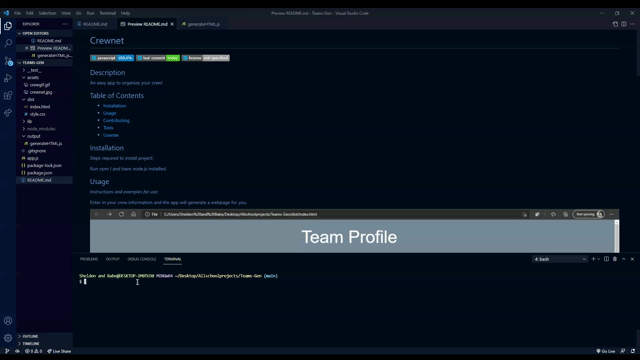

# Crewnet

 

## Description  

An easy app to organize your crew!

## Table of Contents
  * [Installation](#installation)
  * [Usage](#usage)
  * [Contributing](#contributing)
  * [Tests](#tests)
* [License](#license)

## Installation

*Steps required to install project:*

Run npm I and have node.js installed.
Also this app uses inquirer and jest packages so also make sure you run npm install jest inquirer.

## Usage 

*Instructions and examples for use:*

Enter in your crew information and the app will generate a webpage for you.

https://drive.google.com/file/d/1YtOCPgjqDdZl6iizO9wy5hg_ipvvJ45s/view

https://drive.google.com/file/d/1Z0TwbGYnbkydEHvOzaay3_Ig3Eh34OzF/view

## Tests

*Tests for application and how to run them:*

npm run test

## License

MIT License

## Questions?

 

If you have any questions you can chat me up with the information below:

GitHub: [@sstevens22](https://api.github.com/users/sstevens22)

Contact info: smgstevensbusiness@gmail.com